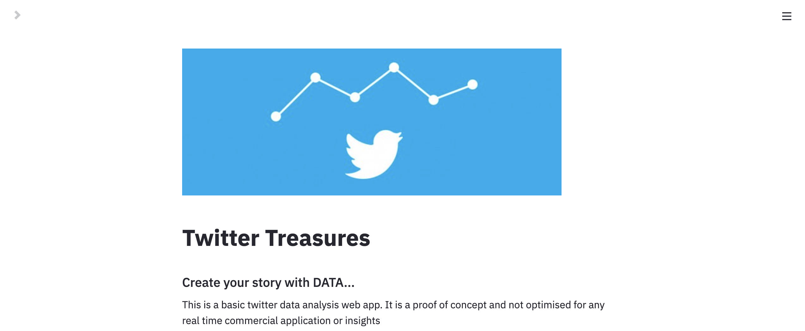

# [Twitter Treasures](https://bit.ly/36vRnGK)

Twitter Treasures

# Features :

On Hashtag/Username/Keyword Search based Tweet dataset

    1. Tweets extraction
    2. Data Cleaning - Twitter data
    3. Basic plots
    	3.1 Tweets source
    	3.2 Location
    	3.3 Language
    4. Wordclouds
    	4.1 Location , Language , Source
    	4.2 Tweets
    	4.3 User description
    5. N-Gram Analysis
    	5.1 Unigram
    	5.2 Bigram
    	5.3 Trigram
    6. Sentiment Analysis
    	6.1 Sentiment count
    	6.2 Sentiment Wordcloud
    	6.3 Hashtage and Username Analysis
    	6.4 Visualise Hashtags , Usernames and Retweets based on sentiments
    	6.5 User followers plot
    	6.6 Sentiment Unigram Analysis (Visualisation)
    	6.7 Sentiment Ngram Analysis (Visualisation)
    	6.8 Sentiment Topic Analysis - using predefined topics (Visualisation)

# Analysis

The below graphs and images are displayed for demo purpose only. No real-time analysis were made based on these images.

Example keyword used for Tweets extraction :

    #COVID19

[For more on Advance Search query](https://zapier.com/blog/twitter-advanced-search-guide/)

## Tweets Extraction Demo

[Tweet Extractor Demo](https://mega.nz/file/JTImWLIY#w8DoyAY_TAfb6ZA2GLNUOjuJtFCberlYDbq-ewuGVfg)

## Tweets Analysis Demo

[Tweet Analysis Demo](https://mega.nz/file/lDYUlBDZ#KjznHPNO-ZgjLnFFeCTSS90UfpiHVrE8YPg6C8kJK3I)

[Link to the App](https://bit.ly/36vRnGK)

# To Do

    1. Using SNS scrape for extraction to get rid of the API limitations.
    2. Add description on how to interpret the graphs
    3. Structure the analysis based on a narration (!)
    4. Named Entity Analysis
    5. Correlation (?) (But how?)
    6. User Analysis
    	3.1 Tweets analysis from a specific user timeline
