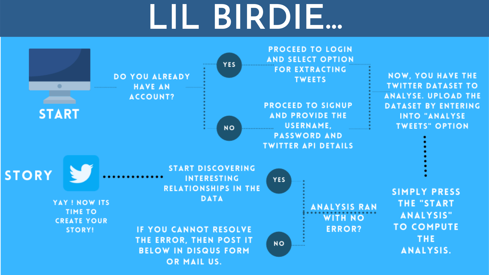
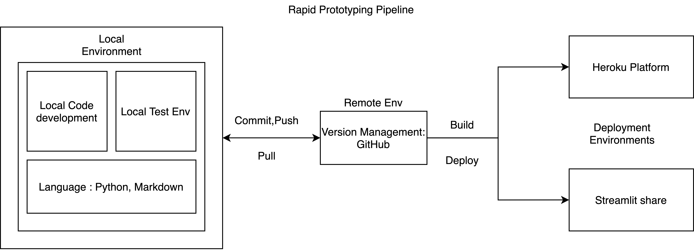

# [Twitter Treasures](https://bit.ly/36vRnGK)

This repository contains the code base to extract tweets from Twitter using Twitter API , analyse and visualise tweets for discovering information hidden in plain sight (data and opinion mining).

# How to Start

# Functions

> 1. Login funcitonalities
>    - Username and Password
> 2. Sign Up functionalities
>
> - Username and Password
> - [Twitter API](https://developer.twitter.com/en/apply-for-access) : Consumer Key and Secret Key
>
> 3. View top trending tweets (Worldwide)
>
> - Provides Top 50 worldwide trending tweets
> - Dataframe with Topic, Tweet Volume and URL
> - Trending topics Wordcloud
>
> 4. Extract Tweets with Recent search Twitter API
>
> - From the current day to last 7 days
> - Advance Twitter Search Query can be used
>
> 5. Analysis of Twitter data
>
> - Tweets preprocessing
> - Metadata analysis (Wordclouds and Bar plots)
>   - Source
>   - Location
>   - Language
> - Tweets and User description
> - Ngram Analysis (Line and Bar plots)
>   -Unigram
>   - Bigram
>   - Trigram
> -     Sentiment Analysis (Naive bayes Algorithm) - Basic Approach
>   - Hashtag Analysis (Bar plots and Wordcloud)
>   - Username Analysis (Bar plots and Wordcloud)
>   - Twitter sentiments visualisations (Bar plots , Wordcloud , Interactive HTML graphs for sentiments visual)
>   - Sentiments topic analysis(Interactive HTML graphs for sentiments visual)
>
> 7. Disqus form for better feedbacks and resolving errors.
>
> - Mail address is also provided for better accessibility

# Rapid Prototyping Pipeline

The amount of time it took for me to build the first version of the usable application was just 2 days from conceptualisation of the idea to deployment. This was my first time development of a usable application.Streamlit is a must know tool for all python based Data App developers.

### Heroku deployment

# To Do

> 1. Using SNS scrape for extraction to get rid of the API limitations.
> 2. Add description on how to interpret the graphs
> 3. Structure the analysis based on a narration (!)
> 4. Named Entity Analysis
> 5. Correlation (?) (But how?)
> 6. User Profile Analysis
>
> - Tweets analysis from a specific user timeline
